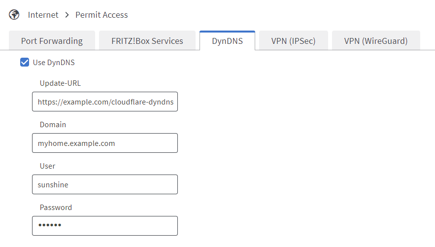

# php-cloudflare-dyndns-api
I wrote this script the other day because I needed an easy way to update my Cloudflare DNS records with my periodically changing home IP address.

It's a single PHP file that acts as a wrapper for the Cloudflare API, so you can update records with a single GET request, compatible with most modern routers (TP-Link, Speedport, Fritz!Box, etc.)

## Requirements
- Cloudflare account (free)
- Cloudflare API key or API token
- Webserver with PHP 8.1 or higher

## Installation
- Make sure a DNS record for the domain you want to update already exists in your Cloudflare account.
- Download `cloudflare-dyndns-api.php` and upload it to your webserver.
- Open the file and edit preferences to your liking.
  - **USE_CACHE** · When set to `true`, the script will write the current IP to a cache file and only update Cloudflare when it has changed.
  - **REQUIRE_AUTH** · When set to `true`, username and password are checked before running the script.
  - **TURN_ON_LOGGING** · When set to `true`, the script will write to a log file.
  - **LOGLEVEL** · The log level. Possible values are `DEBUG`, `INFO`, `WARNING` and `ERROR`.
  - **AUTH_USERNAME** · Only needed if you use authentication.
  - **AUTH_PASSWORD** · Only needed if you use authentication. This script has no bruteforce protection, so make sure to choose a strong password if you host this on a publicly reachable webserver.

```php
  const USE_CACHE = TRUE;
  const REQUIRE_AUTH = TRUE;
  const TURN_ON_LOGGING = TRUE;
  const LOGLEVEL = 'INFO';
  const AUTH_USERNAME = 'sunshine';
  const AUTH_PASSWORD = 'abc123';
```

## Usage: Fritz!Box
Open the FRITZ!Box user interface and navigate to Internet -> Permit Access -> DynDNS and fill the fields. Your router will automatically replace the variables `<ippaddr>` and `<ip6addr>` with your current IPv4 and IPv6 addresses.
- **Domain** · The domain you want to update
- **User** and **Password** · The credentials you set in the PHP file
- **Update-URL** · Use the url shown below, but fill in the following values:
  - **cfemail** · The email address you used to sign up for Cloudflare
  - **cfapikey** or **cfapitoken** · Either your Cloudflare API key or your API token. If you set both, the token will be used.

```text
https://example.com/cloudflare-dyndns-api.php?ipv4=<ipaddr>&ipv6=<ip6addr>&user=<username>&pass=<passwd>&domain=<domain>&cfemail=mail@example.com&cfapikey=XXX
```


## Usage: crontab
This cronjob will update the A Record for myhome.example.com every 10 minutes with your current IPv4 address.
Make sure to replace the values for the following fields:
- **user** and **pass** · The credentials you set in the PHP file
- **domain** · The domain you want to update
- **cfemail** · The email address you used to sign up for Cloudflare
- **cfapikey** or **cfapitoken** · Either your Cloudflare API key or your API token. If you set both, the token will be used.

```text
*/10 * * * * /usr/bin/curl -sS https://example.com/cloudflare-dyndns-api.php?ipv4=$(curl -sS ifconfig.me)&user=sunshine&pass=abc123&cfemail=mail@example.com&cfapikey=XXX&domain=myhome.example.com
```
